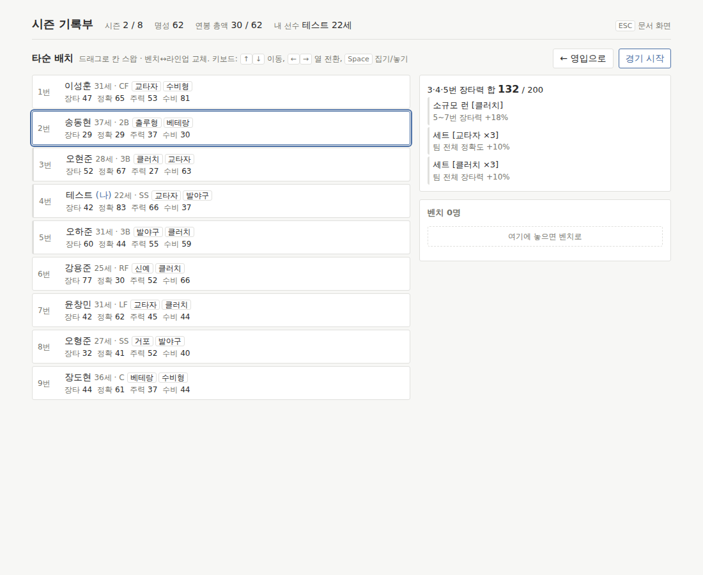

# 커리어 오토배틀러 (야구)

한 판 7분짜리 야구 커리어 오토배틀러. 선수 카드를 영입해 9칸 타순에 배치하면 경기가 자동으로 시뮬레이션되고, 8시즌을 거쳐 은퇴하면 명예의 전당 점수가 나온다.

플레이: `https://<user>.github.io/career-autobattler/` (GitHub Pages 배포 후 링크 교체)


<!-- TODO: 배치 화면 스크린샷을 docs/screenshot.png 에 넣을 것 -->

`index.html` 하나로 동작한다. 엔진(`src/*.js`)은 `node scripts/bundle.js index.html` 로 `<!-- engine:start/end -->` 마커 사이에 결합되어 있으므로, 엔진을 고친 뒤에는 다시 실행해 반영한다.

---

## 게임 규칙

플레이어는 감독이 아니라 **선수 본인**이다. 내 선수 1명은 항상 라인업에 들어가고, 나머지 8칸을 영입·배치로 채운다.

```
드래프트 (1회)
  └─ 시즌 1 … 시즌 8
        ① 영입   상점 카드 5장 중 고르기 (리롤 2회, 추가 리롤은 예산 3)
        ② 배치   9칸 타순 배치
        ③ 경기   자동 시뮬레이션 (텍스트 로그)
        ④ 결과   시즌 정산 + 내 선수 성장 3지선다 + 전원 나이 +1
  └─ 은퇴 → 통산 성적 + 명예의 전당 점수 → 로컬 랭킹
```

### 선수 카드

이름 / 나이 / 포지션(C 1B 2B 3B SS LF CF RF DH) / 태그 **정확히 2개** / 능력치 4종(장타력·정확도·주력·수비, 0~99) / 연봉(억).

태그 8종: `교타자` `거포` `발야구` `수비형` `베테랑` `신예` `클러치` `출루형`

| 태그 | 주 능력치 |
|---|---|
| 교타자, 출루형 | 정확도 |
| 거포, 클러치 | 장타력 |
| 발야구 | 주력 |
| 수비형 | 수비 |
| 베테랑 | 전체 소폭 (보너스의 40%를 4스탯 전부에) |
| 신예 | 성장률 (내 선수 성장 선택지 수치에 반영) |

### 시너지 — 이 게임의 심장

세 종류가 동시에 작동한다. 런은 *배치*로, 세트는 *영입*으로 만든다.

**런 (Run)** — 타순에서 **연속된 칸** 3개 이상이 같은 태그를 공유

| 길이 | 이름 | 효과 |
|---|---|---|
| 3연속 | 소규모 런 | 해당 3명 주 능력치 +18% |
| 4연속 | 중규모 런 | 해당 4명 주 능력치 +28% |
| 5연속+ | 대규모 런 | 해당 전원 주 능력치 +40%, 팀 사기 +1 |

**세트 (Set)** — 같은 태그를 가진 선수 3명 이상이 **서로 다른 포지션**. 타순 무관

| 인원 | 효과 |
|---|---|
| 3명 | 팀 전체 해당 능력치 +10% |
| 5명 | 팀 전체 해당 능력치 +20% |
| 7명 | 팀 전체 해당 능력치 +32% |

**인접 조합** — 바로 앞뒤로 붙으면 발동

| 조합 | 이름 | 효과 |
|---|---|---|
| 출루형 → 거포 | 밥상과 해결사 | 뒤 선수 타점 +40% |
| 발야구 → 교타자 | 히트앤런 | 앞 선수 도루 성공률 +35% |
| 거포 → 거포 | 연속 대포 | 둘 다 장타 +15%, 삼진 +10% |
| 베테랑 → 신예 | 사수와 후임 | 뒤 선수 성장률 +25% |
| 클러치가 4번 타순 | 해결사 | 득점권 상황 보정 +30% |

**클린업 트리오** — 타순 3·4·5번의 장타력(기본값) 합이 **200 이상**이면 팀 득점 +15%. 배치 화면에 합계가 상시 표시된다.

런과 세트 보너스는 합산된 뒤 기본 능력치에 곱해진다. 최종 능력치는 99를 넘을 수 있고, 시뮬에서 확률 상한으로 흡수된다.

### 노화와 성장

- 매 시즌 전 선수 나이 +1. **27세가 피크**, 28~30세 -2, 31~33세 -4, 34세+ -7 (4스탯 전부, 하한 20). 23세 이하 +2, 24~26세 +1 자연 성장.
- 내 선수는 매 시즌 3지선다로 성장: `정확도 +8` / `장타력 +6, 주력 +4` / `새 태그 획득(기존 태그 하나 대체)` 등. 90 이상인 능력치는 성장치 절반.

### 명예의 전당

`통산안타×1 + 홈런×4 + 타점×2 + 타이틀×150 + 우승×300`

| 점수 | 등급 |
|---|---|
| 6000+ | 만장일치 입성 |
| 4500+ | 입성 |
| 3200+ | 후보 |
| 그 미만 | 미달 |

로컬 랭킹 상위 10개가 `localStorage` 에 남는다.

---

## 조작법

- 배치: 마우스 드래그로 칸 스왑 / 벤치 ↔ 라인업 교체. 드래그 중 우측 패널에 새로 생기는 시너지는 초록, 깨지는 시너지는 빨강으로 미리보기
- 키보드: `↑` `↓` 로 칸 이동, `←` `→` 로 타순 열 ↔ 벤치 열 전환, `Space` 로 집기/놓기 (집은 상태에서 이동하면 같은 미리보기가 뜬다). 버튼은 `Tab` + `Enter`
- 경기 로그: `Space` 또는 "빠르게" 버튼으로 즉시 전체 출력
- 결과 화면 성장 선택: `1` `2` `3`
- `ESC`: 패닉 모드 (평범한 강의 노트 문서로 전환, 탭 제목·파비콘도 바뀜. 다시 누르면 복귀. 상태 유지). 탭이 백그라운드로 가면 자동 진입

---

## 로컬 실행

`index.html` 을 브라우저로 열면 끝. 서버 불필요. 외부 요청 0건, 오디오 없음.

엔진 검증과 결합에는 Node 가 필요하다 (제품에는 필요 없음):

```
node tests/run.js          # 단위·흐름 테스트 (36개)
node scripts/balance.js 30 # 밸런스 시뮬 (헤드리스 AI 30커리어)
node scripts/bundle.js     # src/*.js → dist/engine.js 결합
node scripts/bundle.js index.html   # index.html 의 <!-- engine:start/end --> 사이를 교체
```

## GitHub Pages 배포

Settings → Pages → Source 를 `main` 브랜치 루트로. `.nojekyll` 이 있으므로 그대로 서빙된다.

---

## 엔진 구조 (`src/`)

전부 순수 HTML/JS. 모듈 문법 없이 전역 `AB` 네임스페이스에 붙는다. `index.html` 에는 번호 순서대로 `<script>` 로 넣으면 된다.

| 파일 | 내용 | 노출 |
|---|---|---|
| `src/01_constants.js` | 태그·포지션·시너지 테이블·이름 풀·**모든 밸런스 수치** | `AB.C` |
| `src/02_state.js` | 시드 난수, 상태 객체, `localStorage` save/load, 랭킹 | `AB.rng`, `AB.state` |
| `src/03_generator.js` | 카드 생성기, 드래프트 스탯 분배, 노화, 성장 선택지 | `AB.gen` |
| `src/04_synergy.js` | 런/세트/인접/클린업 판정 — **순수 함수** | `AB.synergy` |
| `src/05_sim.js` | 경기 시뮬(텍스트 로그), 시즌 정산, 타이틀, HOF 점수 | `AB.sim` |
| `src/06_game.js` | 화면이 부르는 액션 (상태 전이 + 자동 저장) | `AB.game` |

### 시너지 엔진 API

```js
var r = AB.synergy.evaluate(lineup);   // lineup: 길이 9, 선수 객체 또는 null
r.synergies      // [{type:'run'|'set'|'adj'|'cleanup', name, desc, tag, slots, level, ...}]
r.effective[i]   // 칸 i 의 최종 능력치 {power, contact, speed, defense} (null 이면 빈 칸)
r.cleanupPower   // 3·4·5번 장타력 합 (항상 계산 — 화면에 상시 표시)
r.cleanupActive
r.team           // {morale, score}

// 드래그 미리보기: 가상 배치를 만들어 한 번 더 평가하고 비교
var d = AB.synergy.preview(lineup, AB.synergy.swapped(lineup, i, j));
d.added / d.removed / d.upgraded / d.downgraded / d.kept   // 초록 = added·upgraded, 빨강 = removed·downgraded
```

### 액션 API (`AB.game`)

모든 액션은 `{ok:true, state, ...}` 또는 `{ok:false, error:'한국어 메시지'}` 를 돌려주고, 성공 시 자동 저장한다.

```
newGame(seed?) / resume()
draft(state, {name, position, tags:[2개]})   → phase 'shop'
reroll(state) / buy(state, shopIndex) / release(state, playerId)
openLineup(state) / backToShop(state)
swapSlots(state, i, j) / benchToSlot(state, id, slot) / slotToBench(state, slot) / setLineup(state, ids)
evaluate(state) / previewSwap(state, i, j) / previewPlace(state, id, slot) / canStart(state)
startGame(state)   → phase 'game', state.gameResult.log (문자열 배열, 18~30줄)
finishGame(state)  → phase 'result', state.seasonResult, state.growthOptions (3개, .label)
chooseGrowth(state, index) → 노화 후 다음 시즌 'shop' 또는 8시즌이면 'retired' (state.hof)
ranking()          → 로컬 랭킹 상위 10
```

상태 필드는 프롬프트의 3.3 모델에 `players`(id → 카드), `shop`, `gameResult`, `seasonResult`, `growthOptions`, `hof` 가 더해진 형태다. `lineup`/`bench` 는 선수 id 를 담고 `AB.state.lineupPlayers(state)` 로 객체를 얻는다.

## 밸런스 수치 수정 위치

전부 `src/01_constants.js` 한 파일이다.

| 항목 | 상수 |
|---|---|
| 런/세트/인접/클린업 | `C.RUN`, `C.SET`, `C.ADJACENT`, `C.CLUTCH_SLOT`, `C.CLEANUP` |
| 노화 | `C.AGING` (피크 27, 하락 표) |
| 드래프트 라운드별 예산·명성 | `C.DRAFT.rounds` |
| 카드 품질 ↔ 명성, 연봉 | `C.CARD` |
| 상점 (리롤, 방출 회수율, 명성→예산) | `C.SHOP` |
| 상대 전력, 시즌 난수, 타이틀 기준 | `C.SEASON` |
| 능력치 → 확률 곡선 | `C.SIM` (`hitBase/hitCurve/hitExp`, `hr*`, `steal*`) |
| 명예의 전당 등급 | `C.HOF` |

### 밸런스 조정 근거 (헤드리스 AI 30커리어 기준, `node scripts/balance.js 30`)

- **시너지 효과**: 같은 로스터를 시너지 없이 돌렸을 때 대비 득점 **×1.44**, 시너지를 노려 영입·배치한 팀 vs 무작위 팀 **×1.25**. 목표 1.5~2배에 맞추려 프롬프트 초기값에서 런(12/20/30→18/28/40%)·세트(8/18/30→10/20/32%)를 올렸고, 정확도→타율 곡선을 볼록(`hitExp 1.5`)하게 바꿔 높은 능력치 1점의 가치가 크도록 했다. 클린업 트리오는 240 으로는 한 번도 발동하지 않아(카드 장타력 평균 55~70) 200 으로 내렸다.
- **라인업 변경**: 시즌당 평균 **2.2칸** (목표 2~3). 노화 표와 23세 이하 자연 성장이 주된 압력.
- **우승**: 커리어당 평균 **1.2회**, 분포 0회 60% / 1~3회 25% / 4회+ 15%. 우승→명성→예산의 눈덩이를 막으려 상대 전력이 명성에 약하게 연동(`fameStrength`)된다. 낮은 라운드 지명은 예산 42~52, 명성 15~50 으로 프롬프트보다 폭을 좁혔다.
- **타이틀**: 커리어당 5~6개. 타격왕이 가장 흔하다(내 선수가 런+세트로 정확도 120+ 에 도달하면 타율 상한 .400 근처). 더 희소하게 하려면 `C.SEASON.leader.avgContact[0]` 을 올리면 된다.
- **관전 경기 반영**: 프롬프트대로 한 경기 결과를 144경기에 곱하면 3타수 3안타 하나로 시즌 타율이 .500 을 넘어서, 빠른 시뮬 60회 평균 95% + 관전 경기 5% 로 섞고 선수별 시즌 운(±7%)을 곱한다.

## 라이선스

MIT — `LICENSE` 참고.
